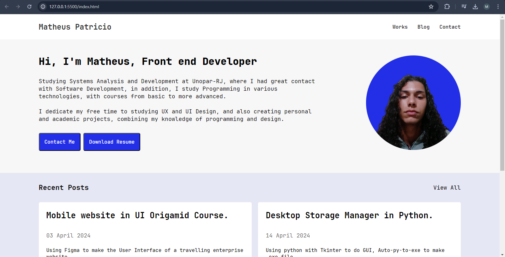
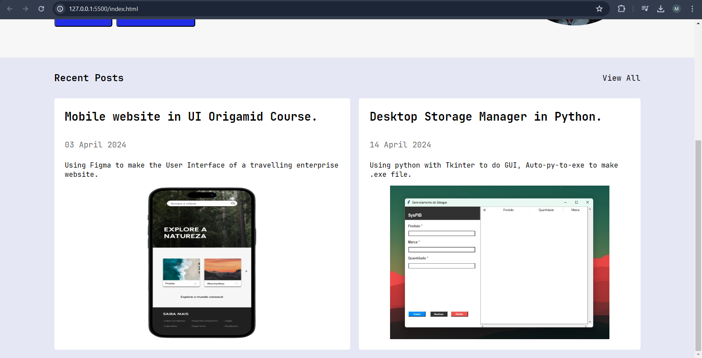
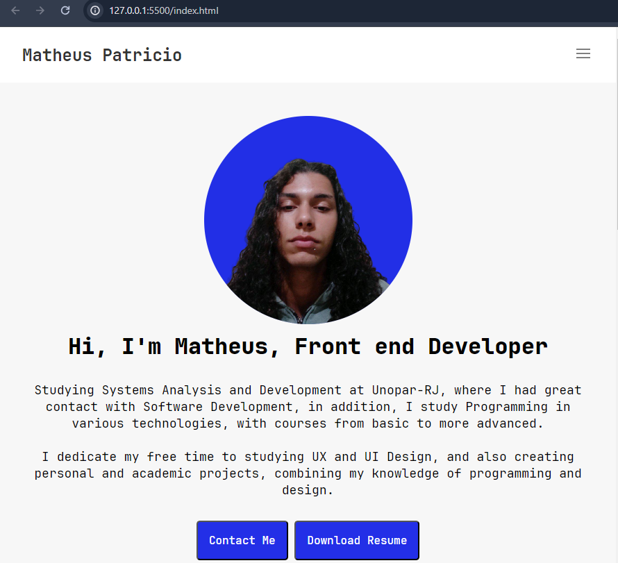
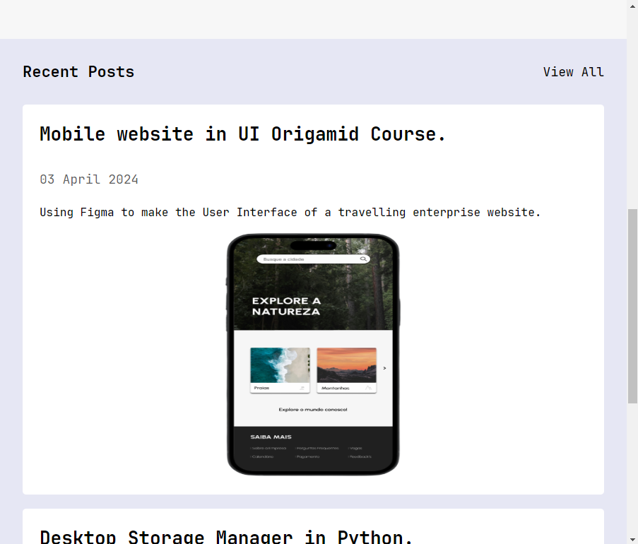
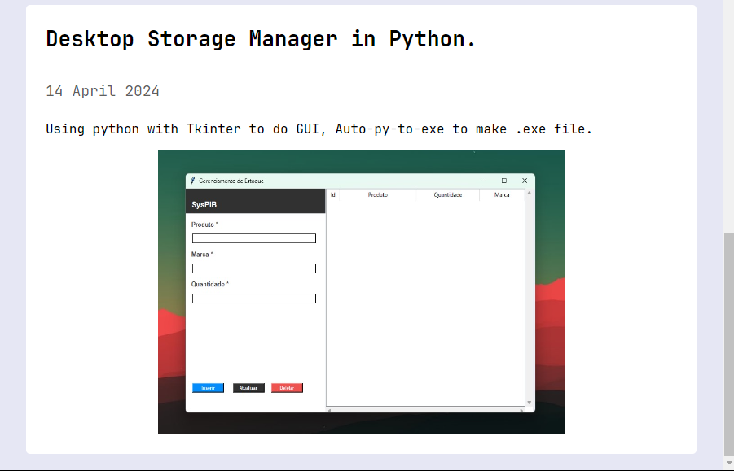

# HELLO, WORLD! (again)

<h3>
Recentemente eu voltei a programar pois comprei meu pc, e para reforçar  
a minha base nos básicos, me matriculei no curso de Front-end com React  
da plataforma Ada.
O curso consiste em uma grande quantidade de fundamentos teóricos e  
práticos desde o mais básico possível até o mais avançado em HTML, CSS e JS.
</h3>

## QUAL É O EXERCÍCIO?

#### O EXERCÍCIO CONSISTIA NA CRIAÇÃO DE UMA PÁGINA ESTÁTICA (SEM JS) E QUE FOSSE RESPONSIVA

FIZ COM MINHA FOTO, DADOS E NOME.

## UTILIZANDO RESPONSIVIDADE:

